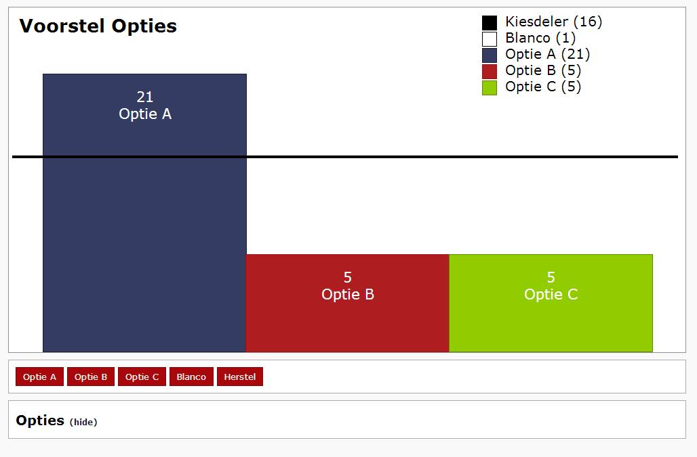

VGST Voter
==========

Een tool voor live resultaten van een stemming.
Bijvoorbeeld een verkiezing van een Bestuur/Senaat of een voorstel.



### Usage
Om te starten clone deze repo en klik op `index.html`.
1. Vul in de titel
2. Vul in de te kiezen opties
3. Druk op start en gaan!

Kiesdeler wordt bepaald met de volgende formule 
```
kiesdeler = (aantal uitgebrachte stemmen - blanco) / (2 * te verkiezen opties) 

te verkiezen opties is bij een voorstel 1, omdat er één uitkomst is. Bij verkiezen van een Senaat zijn er meerdere opties, in ons geval 4. Dus vul dan hier 4 in
```

Han van der Veen
VGST